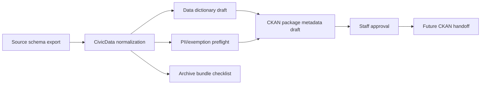

# CivicData Bridge User Manual

## Non-technical staff guide

CivicData Bridge helps a city prepare datasets before they are published to an open-data portal. It is a preparation and review tool, not an automatic publishing robot.

### What staff can do today

1. Review source fields and normalize them into clear open-data names.
2. Draft a data dictionary so residents understand what each field means.
3. Prepare CKAN-style package metadata for a future open-data portal handoff.
4. Run a deterministic preflight for PII or exempt-record field names.
5. Create an archive bundle checklist tied to records-retention schedules.
6. Draft a publication checklist for recurring datasets.

### Required human review

Every dataset still needs staff approval before publication. Staff must confirm the source-system owner, redaction/exemption status, open-data license, retention schedule, and publication target.

### What v0.1.0 does not do

CivicData Bridge does not publish directly to CKAN, does not host dashboards, does not store a data warehouse, does not make legal exemption decisions, and does not redact records automatically.

## IT and technical guide

### Runtime

Install with `python -m pip install -e ".[dev]"` and run with `python -m uvicorn civicdata.main:app --host 127.0.0.1 --port 8137`.

### Architecture

### Endpoints

The public endpoints are listed in `README.md`. All v0.1.0 endpoints are deterministic and local. They do not perform live connector calls or publish data to external services.

### Dependency contract

CivicData Bridge depends on `civiccore==0.2.0`. CivicCore must not import CivicData Bridge.

### Verification

Run `bash scripts/verify-release.sh` before release. The script checks docs, tests, Ruff, build artifacts, and package metadata.
